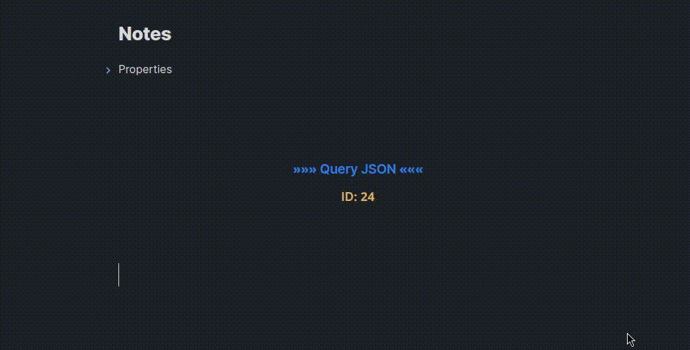

# Q-JSON

[](https://github.com/rooyca/query-json/releases/latest)
[](https://obsidian.md/plugins?id=query-json)

## 📊 Poll

### We need your feedback. Please take a moment to answer ONE question.

[](https://github.com/Rooyca/query-json/discussions/2)

---



Query JSON is a Obsidian plugin designed to simplify the process of querying and extracting data from JSON objects. By incorporating a user-friendly syntax, the plugin enables you to retrieve specific information from JSON data stored within your notes or external files.

## ⚡ How to Use

To utilize QJSON, simply include the plugin's syntax within your note, encapsulating the JSON data or providing a file reference. Below is an example of the syntax:

~~~markdown
```qjson
#qj-id: 23
#qj-file: data.json
#qj-hide-id
#qj-show-json
#qj-desc: -> Test data <-
```
~~~

> [!CAUTION]
> If your JSON files is considerably large it may slow down the rendering process. In those cases is better to [query the file directly.](#query-files-directly)

Then, you can query the data using the following syntax:

```
@23>store.books.0.author;
```

### Querying Data

Crafting queries with QJSON is straightforward, allowing you to refine and extract specific information tailored to your needs. For instance, consider the following JSON:

```json
{
  "store": {
    "books": [
      {
        "author": "John Doe",
        "title": "The Book"
      }
    ]
  }
}
```

To retrieve the author of the first book within the store, use the following query:

```
@23>store.books.0.author;
```

- `23`: represents the object identifier (ID)
- `store.books.0.author`: specifies the path to the desired data

#### Query files directly

Furthermore, QJSON extends its functionality to external JSON files. For example, if you possess a file named `data.json` containing the same JSON data as above, you can use the following query:

```
@data.json>store.books.0.author;
```

## 🏳️ Flags

Query JSON supports various flags to enhance customization and functionality:

#### `#qj-id` INT (required)

This flag denotes the JSON object identifier. It must be unique and numeric.

#### `#qj-hide-id` (optional)

This flag suppresses the display of the identifier after rendering.

#### `#qj-desc` (optional)

Short for "id description," this flag provides a way to describe the JSON object. It is particularly useful for identifying the purpose of the object. The default value is `»»» Query JSON «««`.

#### `#qj-show-json` (optional)

This flag allows you to display the JSON within the rendered output. By default is hidden.

#### `#qj-file` (optional)

If provided, this flag specifies the file path containing the JSON data. In its absence, the plugin scans for JSON data within the code block.

## 🛠️ Contribution

If you encounter any issues or have suggestions for improvement, please feel free to contribute to the project. Your feedback is invaluable in enhancing the plugin's functionality and user experience.
